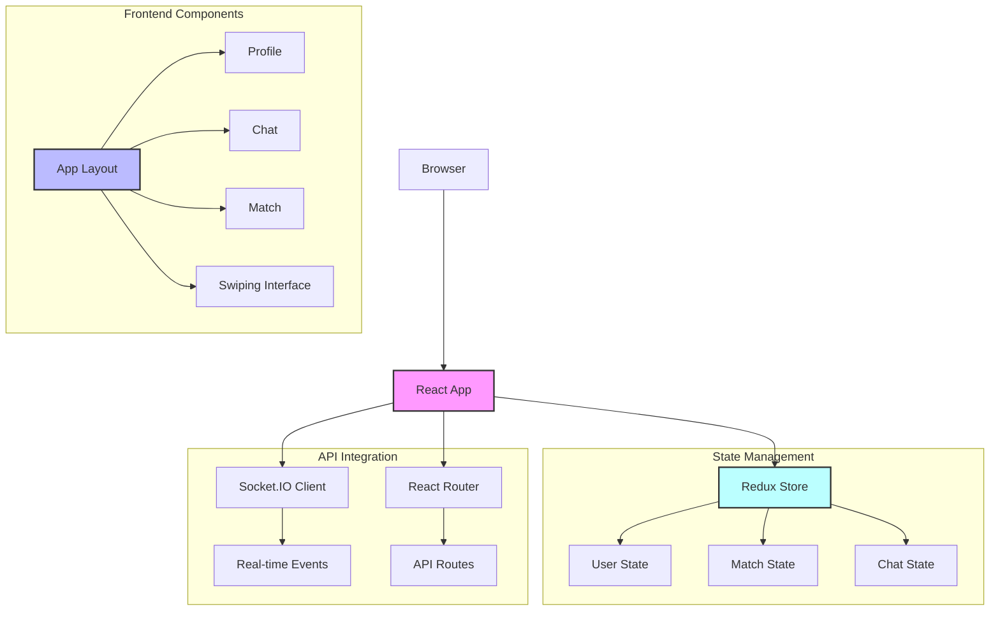

# DevTinder Web

[](LICENSE)
[](https://reactjs.org)
[](https://github.com/yashpreetbathla/devTinder-web/actions)

A modern web application that connects developers based on their skills, interests, and project goals. DevTinder Web provides a Tinder-like interface for developers to find and collaborate with other developers on exciting projects.

## 🚀 Features

- 🔄 Tinder-like swiping interface for developers
- 🔍 Advanced filtering based on skills, interests, and location
- 💬 Real-time chat using Socket.IO
- 📊 User profiles with skills and project history
- 🔐 Secure authentication and data protection
- 🎨 Modern, responsive UI with DaisyUI components

## 🛠️ Tech Stack

- **Frontend Framework**: React 18
- **Build Tool**: Vite
- **State Management**: Redux Toolkit
- **Routing**: React Router v7
- **Styling**: Tailwind CSS + DaisyUI
- **Real-time Communication**: Socket.IO
- **API Client**: Axios
- **Development Tools**: ESLint, PostCSS

## 📱 Architecture



## 🚀 Getting Started

### Prerequisites

- Node.js (v18 or higher)
- npm or yarn

### Installation

1. Clone the repository:
```bash
git clone https://github.com/yashpreetbathla/devTinder-web.git
cd devTinder-web
```

2. Install dependencies:
```bash
npm install
```

3. Start the development server:
```bash
npm run dev
```

4. Open your browser and navigate to `http://localhost:5173`

## 📦 Building for Production

To build the application for production:

```bash
npm run build
```

The production build will be available in the `dist` directory.

## 🤝 Contributing

1. Fork the repository
2. Create your feature branch (`git checkout -b feature/amazing-feature`)
3. Commit your changes (`git commit -m 'Add some amazing feature'`)
4. Push to the branch (`git push origin feature/amazing-feature`)
5. Open a Pull Request

## 📝 License

This project is licensed under the MIT License - see the [LICENSE](LICENSE) file for details.

## 🙏 Acknowledgments

- Thanks to the React and Vite communities for their amazing tools
- Special thanks to all contributors who have helped improve this project

## 📞 Support

For support, please open an issue in the GitHub repository or contact the maintainers directly.

This template provides a minimal setup to get React working in Vite with HMR and some ESLint rules.

Currently, two official plugins are available:

- [@vitejs/plugin-react](https://github.com/vitejs/vite-plugin-react/blob/main/packages/plugin-react/README.md) uses [Babel](https://babeljs.io/) for Fast Refresh
- [@vitejs/plugin-react-swc](https://github.com/vitejs/vite-plugin-react-swc) uses [SWC](https://swc.rs/) for Fast Refresh
